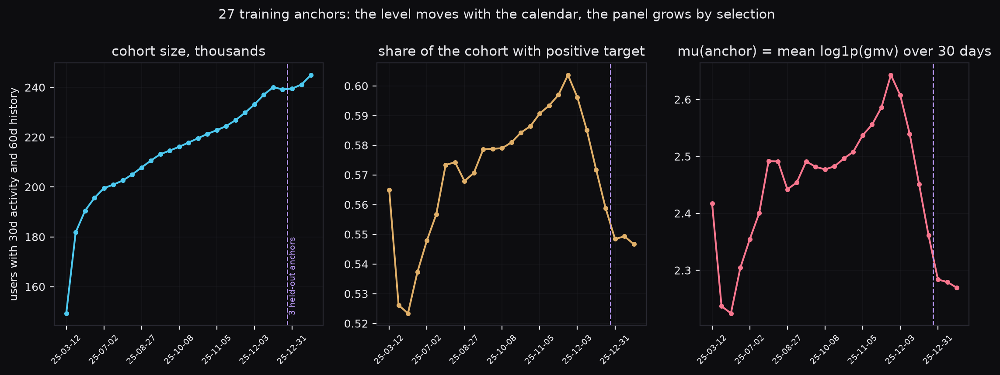
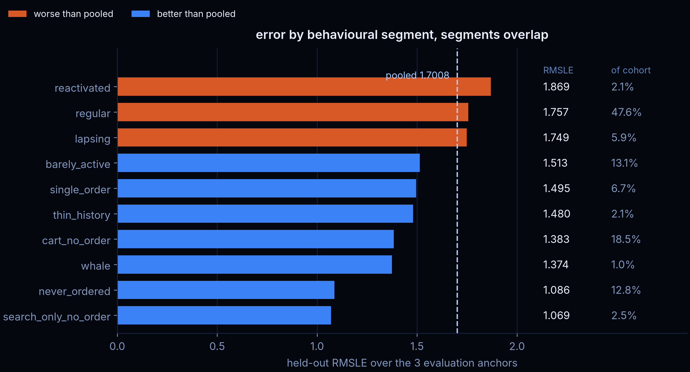

## Команда {.smaller}

::: {.team}
<figure>

Алексей Карасев

НИУ ВШЭ · Rostics MLE

</figure>
<figure>

Джон Ким

НИУ ВШЭ ассистент по математике НИУ ВШЭ

</figure>
<figure>

Дмитрий Николаев

НИУ ВШЭ · ex-X5 DE / DS

</figure>
<figure>

Максим Удовиченко

НИУ ВШЭ · Альфа-Банк DS

</figure>
:::

# Обзор задачи {.divider}

## Что требуется предсказать

:::: {.columns}
::: {.column width="54%"}
Суммарный GMV каждого пользователя за **30 дней**

| Параметр | Значение |
| --- | --- |
| История | 2025-01-01 … 2026-02-13 |
| Целевое окно | 2026-02-14 … 2026-03-15 |
| Пользователей | 250 000 |
| Записей | более 30 млн |
| Лидерборд | public 20% / private 80% |

:::
::: {.column width="46%"}
Метрика — RMSLE, отрицательные предсказания зануляются:

$$\mathrm{RMSLE}=\sqrt{\frac{1}{n}\sum_i\bigl(\log(1+y_i)-\log(1+\max(0,\hat y_i))\bigr)^2}$$

:::

Цель: долгосрочная оценка `LTV` пользователя через прогнозирование `GMV` на несколько недель вперед

::::

# EDA {.divider}

## Структура данных

:::: {.columns}
::: {.column width="52%"}
Одна строка — один пользователь за один **активный** день. Полная таблица
пользователь × день заполнена лишь на ~30%: нулевые дни добавили явно

Точные равенства:

- `gmv = gmv_search + gmv_cat`
- `to_cart = search_to_cart + cat_to_cart`
- `to_ord = search_to_ord + cat_to_ord`
- `search = [searches > 0]`
:::
::::

## Смещение выборки

:::: {.columns}
::: {.column width="46%"}
- Ни у одного пользователя последняя активность не раньше **2026-01-15** — все 250 000 активны
  хотя бы раз в последние 30 дней.
- Ни один не появляется впервые позже **2025-12-15** — у всех минимум ~60 дней истории.
- Дневная аудитория растёт с 43 тыс. до 95 тыс., при этом GMV на активного (~8–9) и доля
  покупателей (~0.14–0.16) стационарны
:::
::: {.column width="54%"}
::: {.box .warm}
Панель отобрана **по выживанию**, а не случайной выборкой. Ранние срезы беднее не потому,
что площадка росла, а потому что так устроен отбор.
:::

::: {.box .accent}
Практическое следствие: обучаться на «одном train/test» нельзя — характеристики среза
зависят от того, где стоит отсечка.
:::
:::
::::

## Уровень уходит, форма остаётся

{width="96%"}

::: {.smaller}
**Модели учат только форму, уровень моделируется отдельно.**
:::

## Календарь: целевое окно ни на что не похоже

:::: {.columns}
::: {.column width="50%"}
::: {.box .warm}
**Целевое окно 2026-02-14 … 2026-03-15 не совпадает ни с одним валидационным.**
Тот же интервал год назад дал GMV на активного пользователя на **9.0% выше** предыдущих
30 дней — это 95-й процентиль обычного 30-дневного дрейфа (медиана +1.7%, p90 +6.8%).
14 и 23 февраля и 8 марта поднимают окно.
:::

::: {.box .accent}
Отсюда два вывода, определившие всю архитектуру: **уровень нельзя брать с валидации**,
и **сравнивать 30-дневные окна между собой без календарной поправки нельзя**.
:::
:::
::::

# Идея решения {.divider}

## Главные идеи {.smaller}

::: {.box .accent}
[1. Разделить уровень и форму]{.boxtitle}

$$y(\text{user},\ a) = \log(1+\mathrm{gmv}^{(30)}) - \mu(a), \qquad
\mu(a) = \overline{\log(1+\mathrm{gmv}^{(30)})}\ \text{по когорте якоря } a$$

Модели учат только кросс-секционную форму — она стабильна месяц к месяцу. Уровень $\mu$
предсказывается отдельно. Это самое важное структурное решение во всём проекте: оно снимает
календарный дрейф с моделей и переносит его туда, где он измерим.
:::

::: {.box .gold}
[2. Панель по якорям вместо одного train/test]{.boxtitle}
27 обучающих якорей, 7 валидационных, purged walk-forward с зазором 30 дней: окно признаков
и окно таргета никогда не пересекаются.
:::

::: {.box .green}
[3. Ансамбль из разных источников смещения, а не разного шума]{.boxtitle}
445 табличных признаков для деревьев и сетей плюс **сырой дневной тензор** для трансформеров —
единственная пара источников, которая действительно читает данные по-разному.
:::

::: {.box .warm}
[4. Не переобучаемся под лидерборд]{.boxtitle}
Две константные пробы дают дисперсию и среднее публичного таргета точно. После этого каждый
скор инвертируется в $\operatorname{Cov}(z,u)$, и финальный сабмит собирается алгеброй, а не подбором.
:::

# Технологический стек {.divider}

## Инструменты и инфраструктура {.smaller}

:::: {.columns}
::: {.column width="50%"}
### Compute

- **Python 3.13**, зависимости и запуск — `uv`
- **polars** (в том числе lazy) на 30 млн строк, **numpy** + **numba** для оконных агрегатов
- **PyTorch 2.13** на CUDA: MLP, TabM, патч-трансформеры
- **CatBoost / LightGBM / XGBoost** — все на GPU
- **scipy**: `nnls` для весов блока, `ndtri` для rank-gauss
- **Optuna** — подбор гиперпараметров
- **SHAP** + **Captum** — интерпретация ансамбля и отдельных моделей

### Code Quality

- `ruff` (линт и формат), `ty` (типы), `taplo` (TOML), `markdownlint` (markdown)
- `pre-commit`: проверки приватных ключей, больших файлов
:::
::: {.column width="50%"}
### Infrastructure

- **Monitoring**: MLflow-сервер с `MCP` сервером для управление контекстом модели об уже проведенных экспериментов
- **Feature storage**: файловое хранилище для признаков
- **AI-Driven ML development**: `Claude Code` для ускорения $\text{idea} \to \text{submit}$
:::
::::

# Описание решения {.divider}

# Преимущества и недостатки {.divider}

## Преимущества решения {.smaller}

:::: {.columns}
::: {.column width="50%"}
**Постановка**

- Лосс на обучении совпадает с метрикой: RMSE по `log1p` — это и есть RMSLE. Никаких переводов между шкалами и связанных с ними потерь $\Rightarrow$ упрощает интерпретацию и принятие бизнесом решений
- Разделение уровня и формы делает решение устойчивым к календарному дрейфу

**Валидация**

- Purged walk-forward на 7 якорях вместо одной отсечки; зазор 30 дней исключает пересечение
  окон
- Fit-якоря и held-out-якоря разделены: веса блока никогда не подбираются там, где мерится
  качество.
:::
::: {.column width="50%"}

**Интерпретируемость**

- Атрибуция на весь ансамбль, групповые пермутации, локальные waterfall по сегментам,
  проверка калибровки по вентилям.
:::
::::

## Недостатки решения {.smaller}

:::: {.columns}
::: {.column width="50%"}
- **Тяжелый ансамбль**: долгое обучение и ресурсоъемкий инференс

- **Сложная воспроизводимость**: часть ансамбля обучается на прогнозах других моделей
:::
::: {.column width="50%"}
- **Смещение выборки не устранено.** Модель обучена на панели «выживших».
  На реальном трафике доля неактивных и неплатящих выше, и уровень придётся перекалибровать
  заново.

{width="100%"}

:::
::::

# Итоги {.divider}

## Польза для бизнеса {.smaller}

:::: {.columns}
::: {.column width="50%"}
**Применение**

- Калиброванный прогноз GMV на 30 дней: можно использовать для прогнозирования бизнес показателей
- Доверие бизнеса прогнозам за счет использования большого количества несколлерированных моделей в ансамбле
- A/B-тестирование изменение recsys'а и поиска: оценки вкладов поиска и recsys'a разделены на уровне признаков
- Прогнозы модели для персонализированных промо

:::
::: {.column width="50%"}
**Развитие**

1. **Данные:** Категории, цены, регион, источник трафика, метаданные пользователя — позволит улучшить качество и интерпретируемость
2. **Переобучение без фильтра активности** — чтобы снять смещение выборки
3. **Упрощение** — "сглаживание" древовидной архитектуры ансамбля в линейный ансамбль
:::
::::

# Спасибо за внимание {.divider .no-kicker}

::: {.box .accent}
**HSE Бобры** — Алексей Карасев, Джон Ким, Дмитрий Николаев, Максим Удовиченко
:::

:::: {.columns}
::: {.column width="50%"}
**Репозиторий**

{width="100%"}

:::
::: {.column width="50%"}
